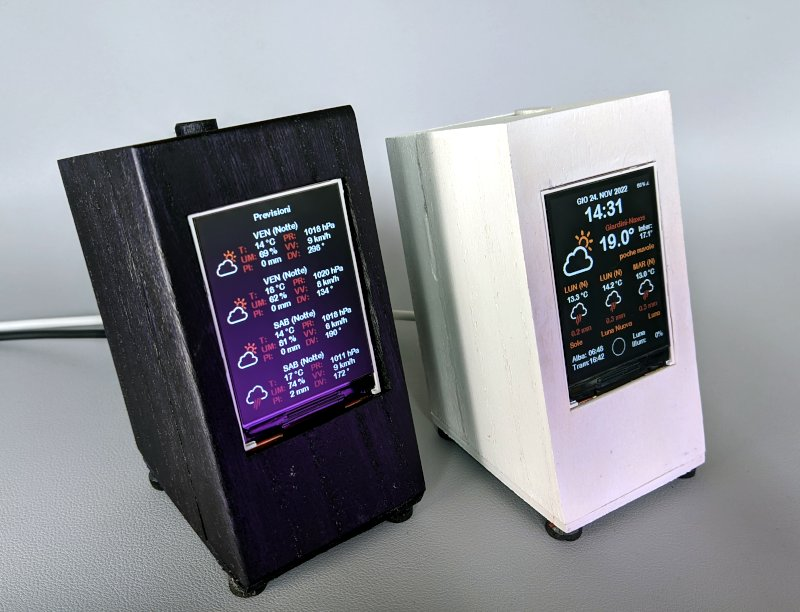

# Internationalized ESP8266 Weather Station

The original design and code of this project was done by [ThingPulse](https://github.com/ThingPulse/esp8266-weather-station).
I reworked an exising fork of that code, the German version by [Mario Ammerschuber](https://github.com/ammerscm68/esp8266-weather-station-improved-german).
Mario's optimizations included, among other things, a captive portal Wifi manager, which is great to avoid hardcoding a Wifi name and password and therefore making the device more portable.

My contribution is focused on internationalization: I created the Italian version, and speakers of a different language can easily localize all the displayed text by editing a single list of strings.

I also set up the weather station to use a push-button instead of touchscreen controls, and added a DS18B20 Temperature sensor to display internal temperature alongside the weather data pulled live from OpenWeatherMap.

Pressing the button switches to the next screen.
A double press switches to the about screen.
A triple press switches to the reset screen.

Project notes and more info at [turiscandurra.com/circuits](https://turiscandurra.com/circuits)
